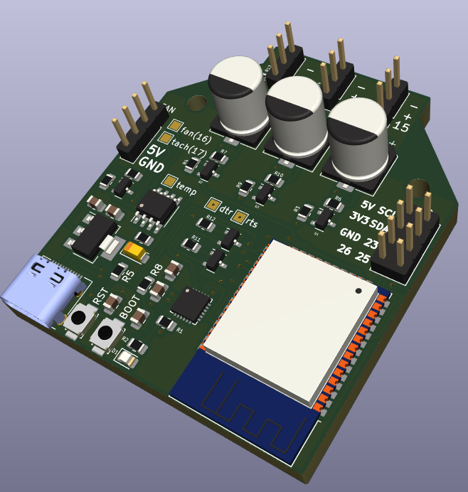

# Intro

Helios is a ESP32 based smart LED controller intended to work with [WLED](https://kno.wled.ge/) firmware.

It features:

* 3x 5V LED output channels
* A PWM fan header (with tachometer feedback)
* I2C and 3x IO breakout
* A USB-C connector and onboard USB-UART adaptor
